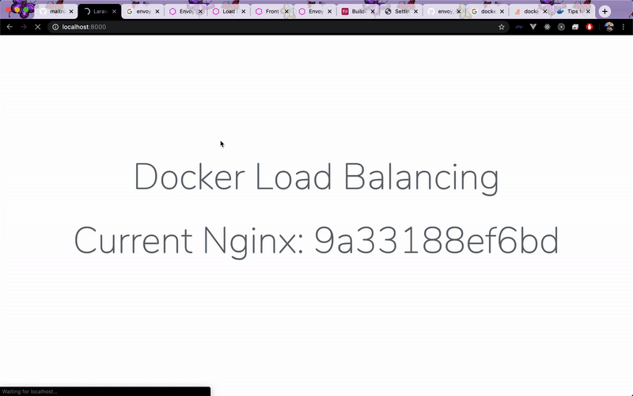

<h1 align="center">
  <div>
    
  </div>
  
  Docker Laravel Load Balancing
</h1>

# How it works
This project demo how to use HAProxy as a load balancing stands in front of Nginx webservers which serve Laravel Application behind

Flow:
```                 
Request -> HAProxy -> Nginx instances -> Laravel app
```
# How to run

From root project, run:
```
docker-compose up --build --scale webserver=3
```
Option --scale webserver=3 will create 3 instances of `webserver` service (you can choose any number of instances you like)

Then Run the following command to setup `.env` file:
```
cp .env.example .env
docker-compose exec app php artisan key:generate
```

Now access `localhost:8000` and try refresh browser, each time you'll see your request is served by a different webserver instance

# Deep dive
## Laravel Horizon
Laravel Horizon is running at `localhost:8000/horizon`

> You can disable it by comment `ENABLE_HORIZON` in `Dockerfile`
## Laravel Task Scheduling
Laravel Task Scheduling is configured at `app/Console/Kernel.php` and auto run for you, you can check by opening `storage/log/laravel.log`, if you see `Scheduler is running`, that means everything is fine

> You can disable it by comment `ENABLE_CRONTAB` in `Dockerfile`
## Database management
Database management server is running at `localhost:8080`
